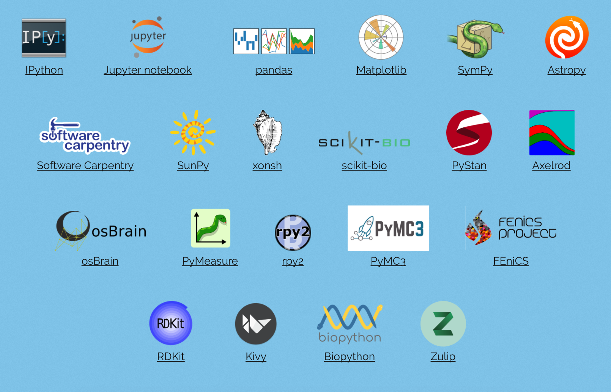
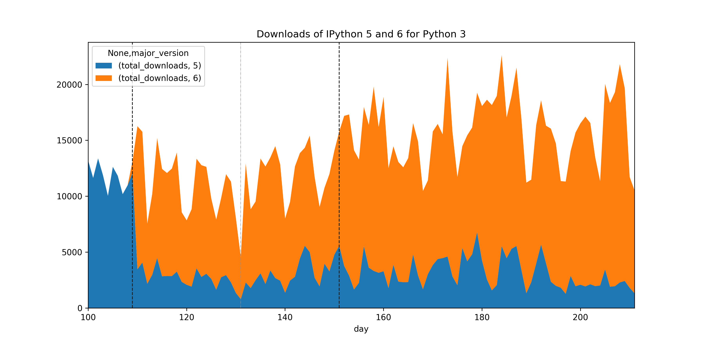
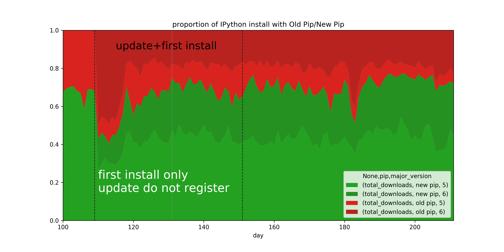
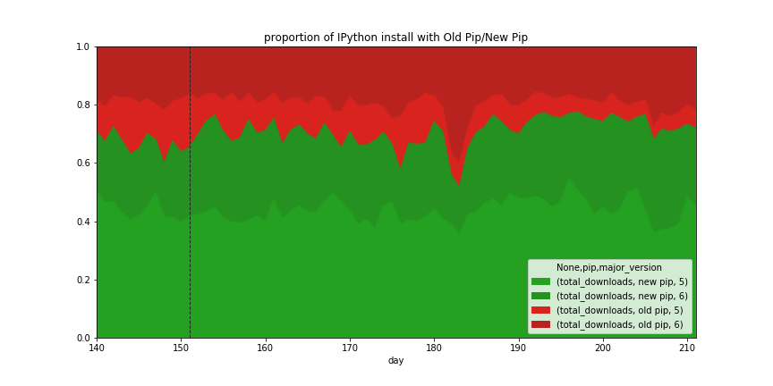
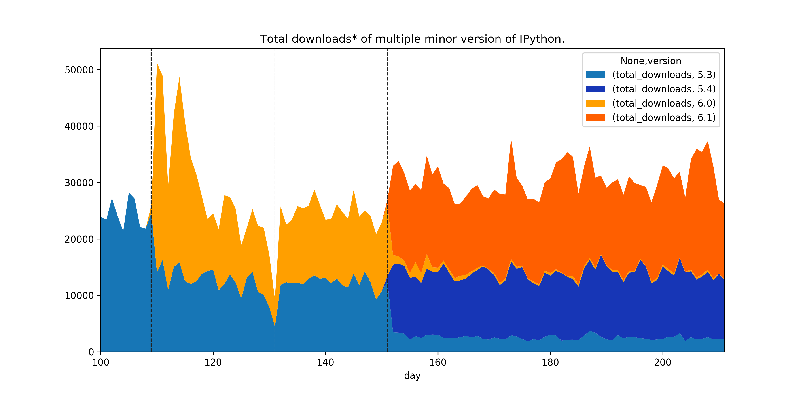

<!-- .slide: data-background="./bridge.jpg" -->

# Building Bridges

## Stopping Python 2 support in libraries without damages

Matthias Bussonnier

PyBay – Saturday August 13 2017 – Fisher West

Slides available at http://bit.ly/pybay-2017 

----

# About Me

-- 

# I'm French


Appologies for Ze téribleuh Frènch akkeucent. 

-- 


Post Doc, IPython and Jupyter Core Dev


GitHub : [@Carreau](https://github.com/carreau) 


-- 


jupytercon.com – August 22-25; NYC


----


## What this talk is **not** about

- Is Python 2 or 3 the right choice? 
- Should I migrate to Python3-only?

--

## What this talk **is** about

We migrated IPython to Python 3 only. 

We care about *all* of our users, Python 2 and 3 alike.

Make the transition the least frustrating for users and developers.

-- 

I'll be describing how we did this, how **you** can do it. How to do it right,
potentially better than us. 

Things we did wrong – what you can learn from the mistake we did. 
And we'd like to learn from **your** experience when you do it. 

--

## Python 2 vs 3 is an **example**

The lessons we've learned are not specific a python2 to python3 transition. 

This also applies to stopping support for any version (e.g., 2.6 or 3.3).

----

# Python 3 Statement

[python3statement.github.io](http://python3statement.github.io/)

List of who is stopping Python 2 support when. 
Resources on how to stop support with minimal frustration for users

-- 





--


Timeline of Python 2 End of Life for various projects.

Note: We should have text notes here to simplify reading this off.

--

# Why


> Numpy won't drop Python 2 while libraries depending on it are still python 2 compatible

<!-- -->

> We'll drop Python 2 once Numpy has dropped Python 2 


-- 

# More informations

[python3statement.github.io](http://python3statement.github.io/)
----

# Application vs Library

-- 

## Application

You deploy it and have complete control over, often standalone. 
 - Dependencies should likely be pinned, in `requirements.txt`
-- 

## Libraries

Reusable components that are shared. 
 - Dependencies in setup.py, often "loose".


-- 

A couple of talk on upgrading an Application: 

 - [PyCon 2017 Keynote – Python3@Instagram (Lisa Guo, Hui Ding)](https://www.youtube.com/watch?v=66XoCk79kjM) 
 - Bringing Python 3 to LinkedIn (Zvezdan Petkovic) <- Not Online yet, that was
   1h ago.

-- 

# Libraries

 - Don't control the deploy environment.
 - Still get issues from users

We want to:

 - Keep a wide compatibility range
 - Keep users happy
 - Minimise work for developers

--

## Some users know where you live...


----

# Scratch your own itch

We wanted to release IPython 6, to be Python 3 only.

We care about Python 2 users, so if a Python 2 user runs

    $ pip install ipython --upgrade

it should install the latest version of IPython 5, not IPython 6!

--

# Keep a LTS Branch


--

## Core of the problem

```bash
$ pip install ipython --upgrade
Installing ipython... doing magic... success

$ python
>>> import IPython
SyntaxWarningErrorError("I Just don't like you.")
```
-- 

## What can we do about that ? 

----

#  Solutions (Not really)

Let's go back to 2016.

-- 

## Just `$ pip install "ipython<6"` on Python 2


- Users do not always read documentation before installing.
- Scripts do not read documentation before installing. 
- Users/scripts do not read error messages.
- dependencies – all packages need update to have conditional dependencies.

--

## Rename ?

That's going to be confusing and void most of the documentation on the
Internet.

Import names different from package name is also a bit tricky to explain
sometime.


(you meant `pip install jinja2` not `pip install jinja`)

<!-- .element: class="fragment" data-fragment-index="1" -->

--

## Wheel only ?

Ok-ish for Pure-Python packages.

Many downstream distributions requires (or really like) sdists.

--

## Use a metapackage

Use a package with virtually no-code that have conditional dependencies, and move the  "real" code to a sub package.

 - You kinda need to re-release old code (can't requires old-yourself)
 - `pip upgrade metapackage` will not pull `core` unless pinned deps


--

As Raymond Hettinger would say if he is in the room


> There must be a better way !


----

# The new way: Python-Requires

-- 

<!--# (re)-Introducting `python_requires`-->

Since December with **pip 9.0.1+**, and **setuptools 24.3**:

```python
# setup.py

setup(..., 
    python_requires='>=3.4'
)
```

Use `pip install` and it will adhere to `python_requires`. 

**N.B.**: Do not invoke `setup.py` directly!

-- 

## In greater detail

--

`python_requires` metadata comes from [pep 345](https://www.python.org/dev/peps/pep-0345/#requires-python), 2005.

But for 11 years nothing implemented or understood it. 

-- 

### setuptools >= 24.3 

The `python_requires` keyword in known only by setuptools versions > 24.3.

- Required to **build** the sdist/wheel and publish the package
- Required to **install** from sdist. 

-- 

### pip >= 9.0.1

Versions of pip < 9 ignore `requires-python`. 

This will result in installing incompatible versions.

---- 


## Call to all package maintainers

* Use tools and services that respect Require-Python
	* pip 9+
	* setuptools >24.2
&nbsp;
<!--  - -->

* Tag your package with `requires_python` 
<!-- .element: class="fragment" data-fragment-index="1" -->
(That's also valid if you do `requires_python<3`, or `requires_python>2.2`)
<!-- .element: class="fragment" data-fragment-index="2" -->

--

# Tell users to update pip!

* Ask your users to upgrade
<!-- .element: class="fragment" data-fragment-index="2" -->

* Remind your users to upgrade
<!-- .element: class="fragment" data-fragment-index="3" -->

* Make sure your users upgrade. 
<!-- .element: class="fragment" data-fragment-index="4" -->


-- 

<table>
  <tr>
    <th></th>
    <th>Python 2</th>
    <th>Python 3</th>
  </tr>
  <tr>
    <td>Old Pip</td>
    <td style="color:red;">✗</td>
    <td style="color:green;">✓</td>
  </tr>
  <tr>
    <td>New Pip</td>
    <td style="color:green;">✓<sup>*</sup></td>
    <td style="color:green;">✓</td>
  </tr>
</table>


---- 

# Defensive packaging

Even if you adhere to that, problems will arise.

Some helpful principles to keep your users as happy as possible

--

1. Update your documentation, CIs, and scripts to use `pip`.

2. Communicate, Communicate, Communicate: Blog...

   <!-- .element: class="fragment" data-fragment-index="1" -->

3. Keep `setup.py` and `__init__.py` python 2 compatible,  
   but catch errors early. 

   <!-- .element: class="fragment" data-fragment-index="2" -->

4. For clear error messages in complicated situations,   
   use multiple lines.

   <!-- .element: class="fragment" data-fragment-index="3" -->

--

## Tell everyone to `pip install`

Update your documentation and scripts to use `pip install [-e] .` 

Reiteration: Do not use `python setup.py <...>`;  
it ignores `requires_python` for dependencies.

-- 

## Communicate

Let it be known to your community what your intentions are. Do not let people be
surprised. Hopefully they will be prepared.

--
## Keep `setup.py` python 2 compatible. 

If `setup.py` runs, most probable reason: 

**pip < 9**. 

Don't just say your package is incompatible with `python2`.

Instead: Ask users to update pip.

--

E.g.,: in `setup.py`:

```python
if sys.version_info < (3, 3):
    error = """
IPython 6.0+ does not support Python 2.6, 2.7, 3.0,
3.1, or 3.2. Beginning with IPython 6.0, Python 3.3
and above is required.

This may be due to an out of date pip.

Make sure you have pip >= 9.0.1.
"""
    sys.exit(error)
```
-- 

## Keep `__init__.py` python 2 compatible

Users will still find ways to avoid `pip` and `setup.py`.  
E.g.:

```bash
$ pip install -e . 
$ ...
$ git pull  # update without install
```

--

E.g., in `__init__.py`: 

```python
import sys
if sys.version_info < (3,3):
    raise ImportError(
"""
IPython 6.0+ does not support Python 2.6, 2.7, 3.0,
3.1, or 3.2. Beginning with IPython 6.0, Python 3.3
and above is required.
""")
```

----

# Summary

<table>
  <tr>
    <th></th>
    <th>Python 2</th>
    <th>Python 3</th>
  </tr>
  <tr>
    <td>Old Pip</td>
    <td style="color:orange;">⚠</td>
    <td style="color:green;">✓</td>
  </tr>
  <tr>
    <td>New Pip</td>
    <td style="color:green;">✓<sup>*</sup></td>
    <td style="color:green;">✓</td>
  </tr>
</table>

<p><span style="color:orange;">⚠</span>Meaningfull warning: Pip out of date</p>
<p><span style="color:green;"><sup>`*`</sup></span> Unless editable install, but
protection in `__init__.py`</p>

----

# You know the difference between theory and practice ? 

In theory it's the same.

   <!-- .element: class="fragment" data-fragment-index="1" -->

----

# Result for IPython

-- 

## Bug reports / complaints

Two. 

- During RC: `python pip install .` got 6.0 on Python 2

Remember: don't use `python setup.py`!

   <!-- .element: class="fragment" data-fragment-index="1" -->

-- 

> My Bad. I thought the pip upgrade error message was irrelevant —  
when I upgrade pip it works.

Remember: upgrade `pip`!

(This also tell us not to trust what users are saying)
   <!-- .element: class="fragment" data-fragment-index="1" -->
---- 


# Ask the numbers !

--

## PyPI download stats on BigQuery

Month Before release ~65% using new pip.

-- 


-- 

## Python 3 adoption of new release



-- 

## Python 2 adoption of new release


--

Pip 9+ does not download IPython 6.0 on Python 2 ! 

Why the big download peek if the pip ratio was ~65% new pip ?

-- 




--

# Missing Data

How many users on **Python 2** have a **new version of pip** and are **not
upgrading**?

Fix by releasing a dummy version of the python 2 compatible version with no
code change. Thus both Python 2 and 3 user should upgrade.

-- 


## Releasing 2 versions at once



-- 



:-(  Some people now have 5.3 Pinned.


---- 

# Migration tips


-- 

Release a **Patch** version with **Zero** source change.
- Observe the change in number on PyPI


-- 

Have **good** error messages telling how to fix things, not why it failed. 
  - Upgrade pip, or
  - pin with `ipython<6`

  (or compatible with: `ipython~=5.1` )
  
   <!-- .element: class="fragment" data-fragment-index="1" -->

-- 

Comunicate in advance

-- 

## Practical tips for **after** the migration

**Resist** the urge to **delete code** if you have an LTS.
- Backport merges will conflict otherwise


-- 

# Conclusions

-- 
 
## On IPython 

- IPython 6+ is Python3 only
- We're still updating the IPython 5.x – Python 2 LTS branch
- Transition has gone relatively well for IPython! 
   - It will only get easier!

--

## On converting packages to Python3 only 

- use packaging tools that respect `Requires_Python`
- encourage everyone, everywhere to use pip 9+
- follow defensive packaging practices 
- Read and contribute to python3statement practicalities section

----

# Thanks!

Python 3 \u2661 Python 2 

(that's a ♡) <!-- .element: class="fragment" data-fragment-index="1" -->

-- 


Slides at: http://bit.ly/pybay-2017

Source material:

[https://github.com/Carreau/talks/tree/master/2017-08-13-pybay](https://github.com/Carreau/talks/tree/master/2017-08-13-pybay)
