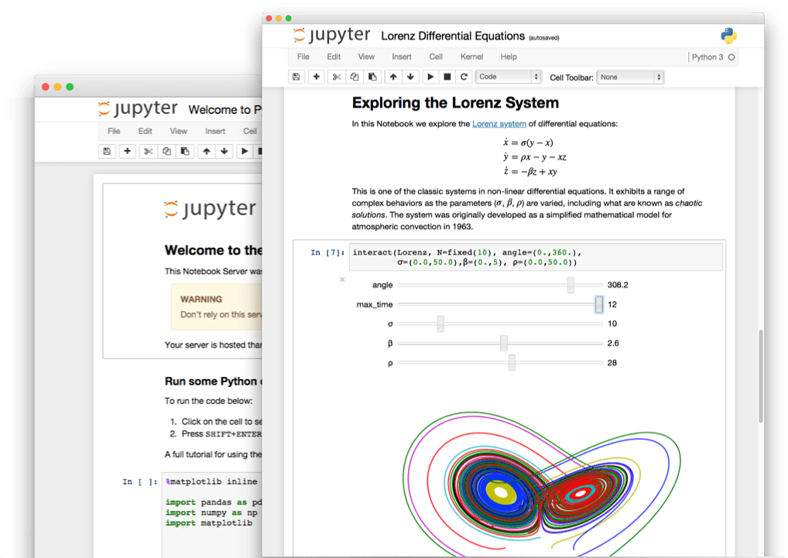

# Jupyter in HPC

Matthias Bussonnier

Feb 28th, 2018
----

<!-- .slide: class="jupyter-light" -->

# About Me

Matthias Bussonnier – UC BIDS - @mbussonn/@carreau

- A Physicist
- Core developer of IPython/Jupyter since 2012
- Post doctoral Scholar on Jupyter

-- 

# 3 Parts

This webinar will be in 3 parts: 
 - Overview of what Jupyter is and typical use case
 - Two case studies

-- 

# Outline

- A bit of History (From IPython to Jupyter)
- What is Jupyter
- Why is Jupyter Popular
- What is Jupyter used for

---- 

# From IPython to Jupyter

<!-- to understand the reason behind Jupyter and how it cames to be we need to
roll back to 2001 when a grad student at the time decided to punt on his
dissertation to work on a small project: IPython
--> 

- 2001: Fernando Perez 
  - Can replace bunch of C/C++/Make/perl script with Python
  - Python REPL is pretty basic for **Interactive** use. 
- Create IPython for Interactive Python.
  - prompt numbers. 
  - gnuplot integration... 

-- 

## Two Programing "modes"

- Software engineer way:
  - Know what to write
  - Run it for long period of time
  - "Human" time small compared to CPU time. 

- "Scientist" way: 
  - Try add-hoc solution in a loop. 
  - Update self-understanding of problem
  - repeat. 
  - Human Time greater than CPU 

-- 

## How Software Engineers see Scientists

> I have no idea what I am doing

-- 

## Exploratory programming

IPython was **designed** for exploratory programming, as a **REPL** (Read Eval
Print Loop) and grew popular, especially among Scientist who loved it to explore
**data**. 

> IPython have weaponized the tab key

>   – Fernando Pérez

---- 

# Birth of the notebook 

(Fast forward 2012)

Decision to refactor IPython to make it "network enabled", originally with a
QT-based frontend to to have inline images.

At that time the web technologies were mature enough that the "Notebook"
frontend was a possibility (websocket, Javascript V8 JIT). 

Let's "Leverage" all of the web stack for display while keeping, the Python
backed for heavy lifting.

-- 

## Multi Language

The "Protocol" spoken over the network can be implemented by many languages not
just Python. So we renamed the Python-Agnostic part to Jupyter.

---- 

# What is Jupyter

Mainly known for **The Notebook**

-- 

## The Notebook

(Highly overloaded term)

- Web server (often local), with a web application that load `.ipynb` documents
  (json), that con contain both code, narrative _and_ results.
- Attached to a Kernel (often local) doing heavy computation.
- Results can be: 
   - Static (Image)
   - Interactive (Pure Javascript side scoll/pan/brush)
   - Dynamic (Call back into Python if necessary)
-- 

## JupyterLab

A couple of Days ago/ Soon should be release JupyterLab:

Extends the notebook interface with Text editor, shell, ...etc

-- 

## Protocols and Formats

Jupyter is also a set of **Protocols and Formats** that reduce the `N-frontends` x `M-backends` problem to a `M-Frontends` + `N-backends`,

- Open, Free and as simple as possible.
  - Json (almost) everywhere
- Thought for Science use case. 
  - Results embedded in documents no "Copy past" mistake. 
  - Can share a 20M hours computation result and view it on my laptop.

-- 

## Ecosytem

**Frontends**: Notebook, JupyterLab, CLI, _Vim, Emacs, Visual Studio Code, Atom, Nteract,
Juno_...

**Kernels**: Python, _Julia, R, Haskell, Perl, Fortran, Ruby, Javascript, C/C++,  Go, Scala, Elixir... 60+_

---- 

# Why the Popularity

-- 

## Interactivity 

Coding is _not_ the full time Job of most of our users. A simple, single tool,
no multi-window and no Command-Line looking interface helps.

Persisting kernel state allows to iterate only on _part_ of an analysis.

Notebook interface give the interactivity of the REPL with the editability and
linearity of a script with intermediate result. Aka "Literate Computing"

-- 

## Separation of state

Computation, and visualisation/narrative/result are in different processes.

 - Robust to crashes
 - Can "Share" and analysis / notebook without having to "rerun" the code. And
   more trustworthy (No copy-past issues).

## Network enabled / web based

User love fancy schmancy colors and things moving. Using D3 and other dynamic
libraries are highly popular

Seamless transition to HPC: `Kernel Menu` > `Restart on Cluster`

Document persist if code crash.

Can be Zero-Installation.

---- 

# Use cases

## Education

The format of the notebook is attractive for Education/Tutorial
  
## Small Data analytics

AKA "Fit in memory", run on your laptop. 

--

# HPC

## Interactive Cluster. 

- Run notebook server on a Head node, 
- Run 

-- 

# Example of Famous notebook workflow. 

LIGO gravitaional wave detection: 

- Static view: https://losc.ligo.org/s/events/GW150914/GW150914_tutorial.html
- Executable online (with subset of data) http://beta.mybinder.org/repo/losc-tutorial/quickview
(https://losc.ligo.org/tutorials/)

Pangeo 

----

