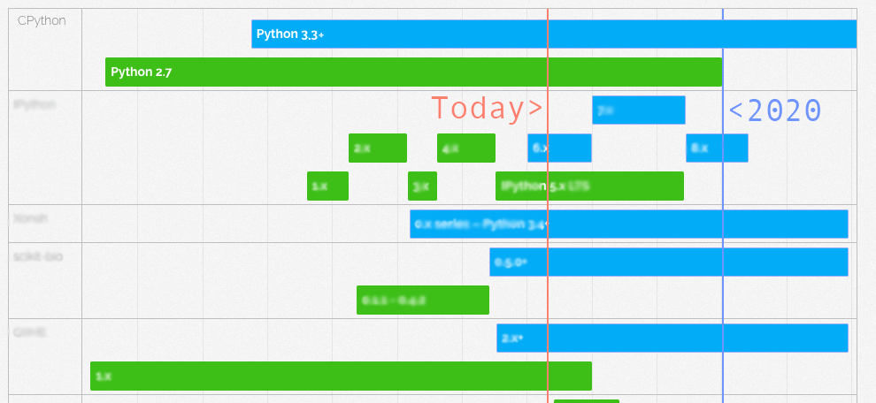

<!-- .slide: data-background="./cityscape.png" -->

# Building Bridges, not walls

## Ending Python2 compatibility in a user friendly manner

M. Bussonnier & M. Pacer

Slides available at https://short.url

----

# About us

We have been Both Working on the IPython and  Jupyter Project for respectively
5 and 1 year. 

github:@Carreau/twitter:@Mbussonn


github:@mpacer/twitter:@

----

## What this talks is **not** about

- Is Python 2 or 3 the right choice 
- Should I migrate to Python3-only

--

## What this talk is about

We decided to migrate IPython to Python 3 only

Ho to make the transition the least frustrating for users and dev.

--

## 2 vs 3 is an **example**

This talks does apply to stopping support for 2.6, or 3.3

----

# Python 3 Statement

[www.python3statement.org](http://www.python3statement.org/)

List of who is stopping support when. 
Resources on how to stop support with minimal frustration for users

--


--



----

# Scratch your own itch

We want to release IPython 6, the code base will be Python 3 only. 
IPython 5 will still be stable (LTS). So we'd like Python 2 user to

    $ pip install ipython

--

## Core of the problem

```python
$ pip install ipython --upgrade
Installing ipython... doing magic... success

$ python
>>> import IPython
SyntaxWarningErrorError("I Just don't like you.")
```

----

# [Not really] Solutions

Let's go back to 2016.

-- 

Just use `$ pip install "ipython<6"` on Python 2

--

- Users do not always read documentation before installing.
- Scripts do not read documentation before installing. 
- Users/scripts do not read error messages.
- dependencies – all packages need update to have conditional dependencies.

--

## Rename ?

That's going to be confusing and void most of the documentation on the
Internet.

Import names different from package name is also a bit tricky to explain
sometime.

--

## Wheel only ?

Ok-ish for Pure-Python packages.

Many downstream distribution requires sdist.

--

## Use a metapackage

Use a package with virtually no-code that have conditional dependencies, and move the  "real" code to a sub package.

 - You kinda need to re-release old code (can't requires old-yourself)
 - `pip upgrade metapackage` will not pull `core` unless pinned deps


--

## use a pip ~~bug~~ "Hidden Feature":

```python
# somewhere in pip
_py_version_re = re.compile(r'-py([123]\.?[0-9]?)$')

# somewhere else
if is_tar_gz(file):
    match = self._py_version_re.search(version)
    if match:
        version = version[:match.start()]
        py_version = match.group(1)
        if py_version != sys.version[:3]:
            self._log_skipped_link(
                link, 'Python version is incorrect')
            return
```                

-- 

## use a pip ~~bug~~ "Hidden Feature":

You can publish `ipython-py3.3.tar.gz` and `ipython-py3.4.tar.gz` and
`ipython-py3.5.tar.gz` and `ipython-py3.6.tar.gz` and `ipython-py3.7.tar.gz` to
be future proof.

But it does not work beyond Python 3.9... 

----

## The new way : Python-Requires

(insert a lot of work here)

As Raymond Hetting would say if he is in the room

-- 

> There must be a better way !


--

# (re)-Introducting `python_requires`

Since December with pip 9.0+, and recent setuptools:

```python
# setup.py

setup(..., 
    python_requires='>=3.4'
)
```

And `pip install .` not invoking `setup.py` directly.

-- 

## In details

-- 

`python_requires` metadata comes from See pep 345, 2005.

But nothing implements/understand it. 

-- 

### Requires setuptools > 24.3 

`requires_python` is an unknown keyword in previous setuptools version.

- Required to **build** the sdist/wheel and publish the package
- Required to **install** from sdist. 

-- 

### Require pip 9+

Old versions of pip will gladly ignore this metadata.
and will install incompatible versions.


---- 

# Failures modes

Handle everything that can happen, then deal with everything that can't.

-- 

## good error messages

Keep setup.py python 2 compatible. 

Fails **before** setup()

If you hit this case the most probable reason : ** pip is out of date**. 

--

**Ask user to update pip, ** Do not let installation finish.

-- 

```python
if sys.version_info < (3, 3):
    error = """
IPython 6.0+ does not support Python 2.6, 2.7, 3.0,
3.1, or 3.2. Beginning with IPython 6.0, Python 3.3
and above is required.

This may be due to an out of date pip.

Make sure you have pip >= 9.0.1.
"""
    sys.exit(error)
```

-- 

## Keep `__init__.py` python 2 compatible

Raise your own error message (inspiration from before).

User will figure out way to avoid `setup.py`. e.g.:

```bash
$ pip install -e . 
$ ...
$ git pull  # update without install
```

-- 

## $ pip install .

Do not use `setup.py <...>` directly

Update your documentation and scripts to use `pip install [-e] .` 

Invoking `setup.py` directly will not respect the `reauires_python`

-- 
## Use multiline error messages
--

# For IPython 6.0


## First Week :
  - Pip 9 - Python 3 : 45.586 
  - Pip 8 - Python 2 : 92.386 – 2x - Not Ok

## Second Week :
  - Pip 9 - Python 3 :&nbsp;40.996 
  - Pip 8 - Python 2 : &nbsp;&nbsp;9.973 – 0.25x - Still not Ok, but better

-- 

## Bug reports / complaints

Two. 

- During RC : `python setup.py install` got 6.0 on Python 2 – now documented.

- "My Bad I did not read the error message"


----


1. The Problems, and solutions (12 min)
2. Under the hood (7min)
3. TL;DL (too long didn't listen), AKA conclusion. (2min)


http://www.smbc-comics.com/?id=2939 maybe ?


----


Detailed Abstract
=================

1. Intro: The Python 3 statement and IPython
--------------------------------------------

A growing number of libraries and library authors have announced that they are
planning on stopping support for Python 2, no later than 2020, if not already.
It is also known that a number of users will not migrate to 
Python 3 by the time that change happens.

Currently, these once-python-2-compatible packages – packages that at one time
were compatible with Python 2 and 3, but are now releasing a Python-3 only
version of the package – create a danger for that libraries extant Python 2
users. In particular, the challenge lies in ensuring that Python 2 users cannot
install or upgrade to the most recent Python 3 only compatible version. The
ease of upgrading by mistake is too great, and the annoyance is particularly
trenchant as the issue may not manifest until run-time.

Upgrading should be made as seamless as possible, regardless of which Python
version is being used. Breaking user's systems during an upgrade can only
reinforce the feeling that "Python Packaging is broken" and the (inaccurate)
impression that "Python 3 zealots are introducing incompatibilities only to
disrupt the Python 2 ecosystem". In fact, developers who are interested in
moving toward Python 3 care deeply about those who wish to still use Python 2
and are working hard to make it possible for the two ecosystems to live in
harmony. 

This is the movement behind http://www.python3statement.org/

2. The gotchas and old solutions
--------------------------------

In this section we'll dive into the various solutions that were available as of
mid-2016 for releasing a Python 3 only package before showing what is now
possible.


Up until recently, you could tag `wheel`s as being Python 3 only, but that
approach breaks when releasing a `.tar.gz`. Pip `<9.0` considers the latest
`.tar.gz` of a package as the "most recent version", regardless of which Python
version is invoking pip. Then, the new, once-python-2-compatible packages are
seen as _still_ compatible with Python 2, thereby breaking users' systems
on upgrade. 

Several workarounds were up until recently possible, and the only solution. 

Do Nothing
~~~~~~~~~~

Do nothing. Just release your new package that uses some Python 3 only
features. It's super easy. You just need to release.

This approach is not without drawbacks: some users and dependees'
maintainers will chase you to the end of the world with a chainsaw because you
broke their systems. You likely don't want that.

We know of a limited number of packages that have done that, like Nikola. 

Change your package name
~~~~~~~~~~~~~~~~~~~~~~~~

Instead of releasing a new version, you can release a "new" package with a new
name, that just happens to contain the same functionality as your
once-python-2-compatible package.

In this case, it's obvious for users which packages are to be used with which
Python systems.

The downside to this is that, all users need to be made aware of the new name,
and explicitly migrate to it everywhere. In this action, you invalidate many
users' habits, their code, and much of the documentation that already exists
online.

Wheel only
~~~~~~~~~~

Releasing a package only as a wheel can allow you to avoid pip `<9.0`'s Python
3 only problem with `tar.gz`s.

For pure python packages, this is relatively easy to do.

There are downsides. Many systems and downstream distributors do rely on or
prefer source-distributions. It is not possible to release wheels for all
packages, particularly those that are not pure python packages. Wheels make a
strict, coarse Python 2 vs Python 3 dichotomy; this stops you from expressing
dependencies on minor python revisions.

Metapackage
~~~~~~~~~~~

It is possible to release a meta-package that has _virtually_ no code and rely
on conditional dependencies that install its actual core code on users' system.
For example, Frob-6.0 could be a meta-package which depends on Frob-real-py2 on
Python <3.0, and Frob-real-py3 on Python >= 3.4. While this approach is
_doable_ this can make for confusing imports.

Using a metapackage has many advantages, or at least lacks the disadvantages of
the other solutions. For example, you don't change the package name, though it
requires a second package on PyPI, potentially leading name confusion. For
example : Frob-6.0 (metapackage) with FrobForPy3-60 (dependency). 

One of the downsides is that this annoys developers who then have to maintain 2
separate but dependent packages. From a user's perspective, errors might come
from FrobFromPy3 but appear to come from Frob-6.0. Upgrading your package
becomes more complicated, as you need the user to explicitly upgrade
dependencies; `pip install -U frob` would only upgrade the meta-package.

Example: None to our knowledge, but we considered it for IPython.


Release multiple Sdist
~~~~~~~~~~~~~~~~~~~~~~

One little known feature of pip is that if your sdist name ends in `py-X.y`,
then this sdist will only be installed on Python X.y.

This allows targeting only a subset of Python minor versions by publishing
multiple sdist. 

On the other hand, you _have_ to publish N source-dist for you package. And,
this includes potential future version of Python which requires making tough,
unknowable decisions. Is the version of Python post 3.9 be 3.10 or 4 ?

You can't target only a minor as your user not solely consist of a specific
minor version of Python. 

Also, PyPI does not allow you to upload multiple sdist. So this solution won't
work if you want to be in the cheeseshop anyway! Still you can find packages
using this.

The new way : Python-Requires
~~~~~~~~~~~~~~~~~~~~~~~~~~~~~

When you use setuptools > 24.2, you can set the `python_requires` metadata in
your `setup.py`. Recent changes to PyPI/warehouse return a `python_requires`
metadata in response to API calls. Pip 9.0+ knows how to make and interpret
those API calls. This means that if you use setuptools 24.2+,  set
`python_requires` metadata,  then pip 9.0+ will only install versions of your
software compatible with the currently running version of
Python, even if your _newest_ release is Python 3 only.

This avoids most of the downsides of other solutions: No need to change package
names, create a new package or release wheels only. Most importantly, easier to
support your Python 2 users, and no need to jump through hoops to do so. It can
be as simple as a single line change to your source.

There are still a few downsides. For example, installing the last compatible
version won't work for your users with pip < 9.0. Installation may fail as well
if setuptools < 24.2 is used, as newer versions of setuptools understand more
arguments for `setup()`.

This is why it is all the more important to encourage Python 2 users (in
particular) to upgrade their pip version to 9.0+.


Mitigations in case of failure
~~~~~~~~~~~~~~~~~~~~~~~~~~~~~~

Despite all the best effort put into ensuring a non compatible version will not
try to be installed, this might still happen and lead to failure of the
installation process, or at import of the library. Regardless of the failures
it is _critical_ to provide users with the right error messages and _solutions_
to the problems that arise. Providing _early_ warnings to regular library users
that things are soon to change helps reduce user surprise and dissatisfaction,
which should also stem the flow of the inevitable compatibility related bug
reports.

There are a variety of countermeasure and mitigation that can be deploy to make
sure these care are as rare as possible, leave the installation in the usable
state. 

Conditional dependency depending on the Python version in dependents package is
one of the mitigation we will discuss. 


3. Under the Hood – Updating the Python Packaging stack
-------------------------------------------------------

While Pep 503 describes a mechanism by which a package can be tagged as Python
3 only, this still not implemented as of mid-2016 for a variety of reasons. For
a Python 3 only package to be not installed 2 critical pieces of packaging
software need to _understand_ this metadata:

A) The package manger

For a package to install only on compatible python versions, the package
manager needs to access and apply compatibility information. Pip <9.0 does not
understand the `python_requires` metadata. It is also _preferable_
for the Package manager to get this information _before_ downloading or trying
to install packages. We'll describe how pip gets this information
from the package repository and how pip decides what to install. For those with
internal deployments: it is crucial that you understand these inner workings so
you can diagnose the origin of the errors users can encounter.

B) The Package index.

While the package index (aka PyPI), stores some of this information, it lacked
exposing it to pip, and querying this information was extremely slow.

The current Package distribution infrastructure is a (complex) beast, it is
interesting to dive into it, see the current status, and what changes can come
in a near, or further future. Additionally, by seeing what changes cannot be
made given the current environment, we can learn about the inner workings of
some of the most important parts of the python ecosystem.

We'll discuss how package information is stored and how we changed it. PyPI
legacy and warehouse share a database. Any change is tricky as PyPI legacy has
close to no tests at all, despite its crucial place in the Python ecosystem. 

In order to make the simple-repository metadata available in a fast an
consistent manner, we modified the common database to ensure it houses and
maintains the correct information. We'll discuss why the `python_requires`
field is set on a per-file basis, while it is supposed to apply to a release.

In a perfect world this would have of course work in a first try, but this was
without counting that PyPI-legacy was operating in unexpected ways on the
database. We'll discuss a bit how PyPI-legacy differs from warehouse, (And how
to configure your system to use warehouse which is better harder, faster
stronger.)

Despite many legends about the current state of python packaging, contributing
to this infrastructure is less scary than usually depicted. Recent improvements
documentation continues to improve contributor friendliness.

4. Conclusion
-------------

TL:DR; of the main points. And while we've put emphase on Py2/Py3, this
approach does work on the opposite direction, or for minor versions. 

Outline
=======

  1. Intro (4min):

    - Who am I(the presenter) and Who are we(the authors)
    - History of Python releases/ End of life.
    - The Python 3 statement.
        - Some library will migrate to Python 3 only by 2020.
        - We don't want it to be a hassle for Python 2 users.
        - We might want to have a Python 2 LTS.
    - We <3 users of Python <3

  2. The Problems, and solutions (12 min)

    - How to upgrade a library to Python 3-only ? Current (2016) state:
      - no way to tag the python_requires metadata.
      - Release wheel only: Downstream distributor are sad
      - multiple Tar.Gz a removed "Feature".
      - Fake Meta package: can also break update.
    - Use new setuptools
      - you can now set the python_requires. How does it work ?
      - Still users might not have the right setuptools.
        They will install a non-workign version.
      - Fail early at runtime. With a clear error message.
    - PIP < 9.0 does not understood this medatata item.
      - Fail early at setup.

  3. Under the hood (7min)

    - The `python_requires` metadata
        - Original pep
        - new Pep
        - pypi `/simple/` repository URL
    - PIP:
        - Read info from the `simple-repository`
    - Warehouse vs PyPI legacy
        - Warehouse 100% coverage, docker based, easy to contribute.
        - PyPI legacy. Here be dragons. (many fewer dragons now)
        - Share a single DB. Bottle neck that needed to refactor for speed.
    - You too can contribute to Python packaging now

  4. TL;DL (too long didn't listen), AKA conclusion. (2min)

    - use pip 9+
    - upgrade setuptools
    - Question and Contribution to gotchas, read and contribute to
      python3statement practicalities section.

